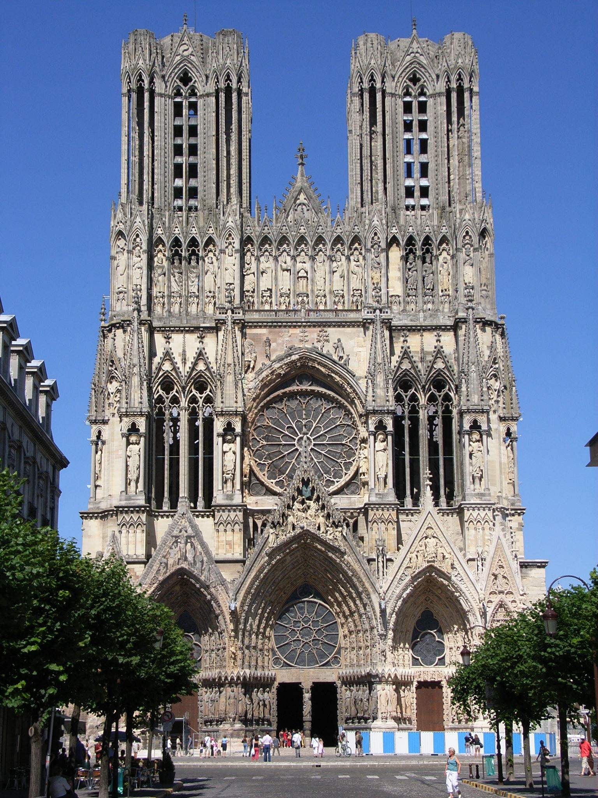

# Введение

## Готический собор — «каменная книга»

**Готика** — стиль, зародившийся в Иль-де-Франс в середине XII века.

- Современники звали его _opus francigenum_ — «французское дело»
- Слово «готика» — насмешка эпохи Возрождения


## Термин и определение

::: {.columns}
::: {.column width="58%"}

> Готический собор — это не здание, а образ мира,
> где свет заменяет стену, а каркас — тяжесть камня.

**Контрфорс** — наружная опора, принимающая распор свода.

**Аркбутан** — полуарка, передающая распор от свода к контрфорсу.
:::
::: {.column width="42%"}

:::
:::

# Конструкции

## Паутина смыслов

Готическая конструкция — система, где **нервюрный свод**, **аркбутан**
и **контрфорс** работают на общую цель. Схемы из Excalidraw импортируются
как обычные изображения:


## Хронология

| Период    | Этап           | Характерная черта   |
| --------- | -------------- | ------------------- |
| 1140–1200 | Ранняя готика  | Сен-Дени, Лан       |
| 1200–1280 | Высокая готика | Шартр, Реймс, Амьен |
| 1280–1500 | Поздняя готика | Пламенеющий стиль   |

# Практика

## Задание

Сравните романский и готический соборы по трём критериям:
стена, свет и высота. Заполните таблицу или схему.

Подумайте, какую роль в этом различии играет **аркбутан**.



```{=typst}
#focus-slide[
  «Свет — главный строительный материал готики»
]
```
