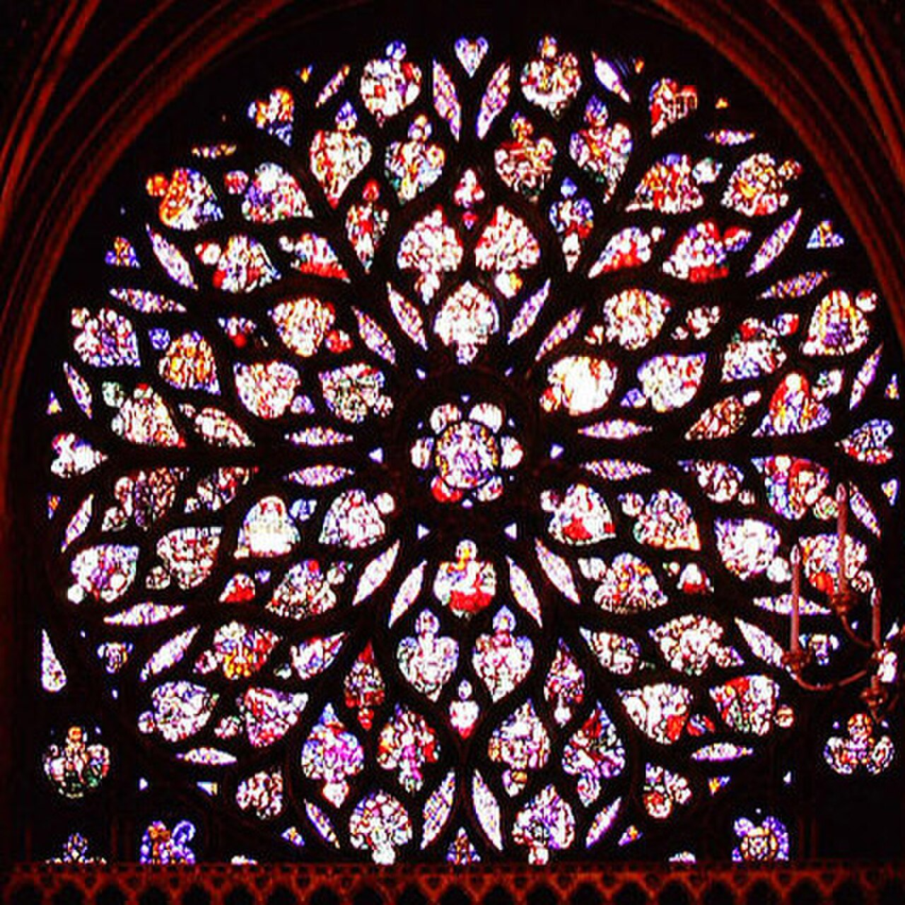
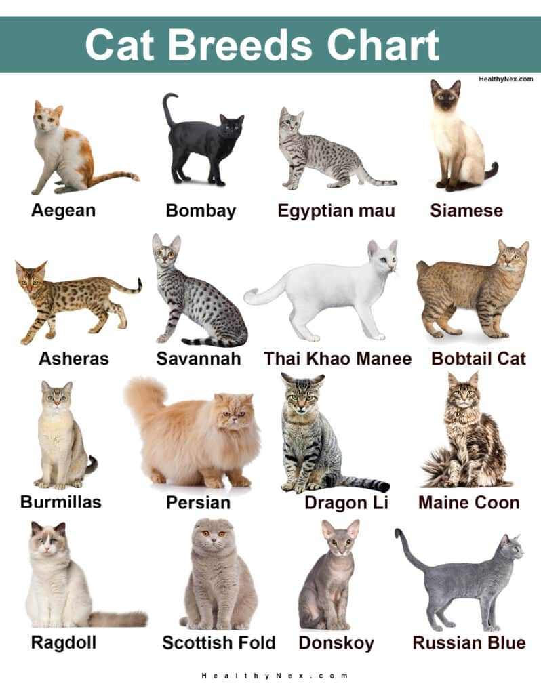
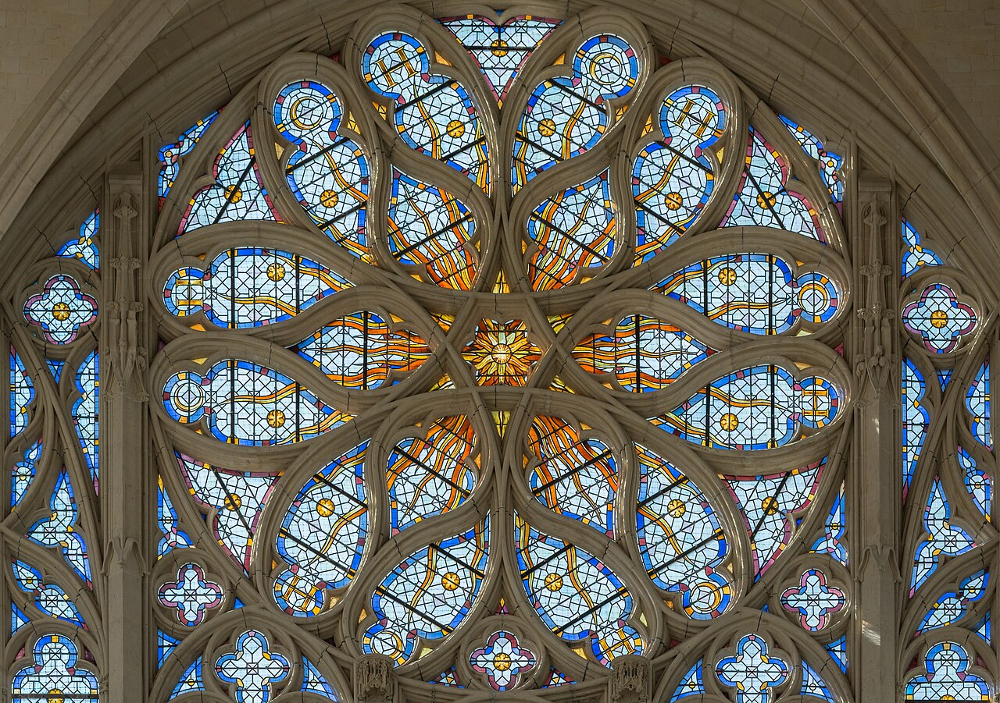
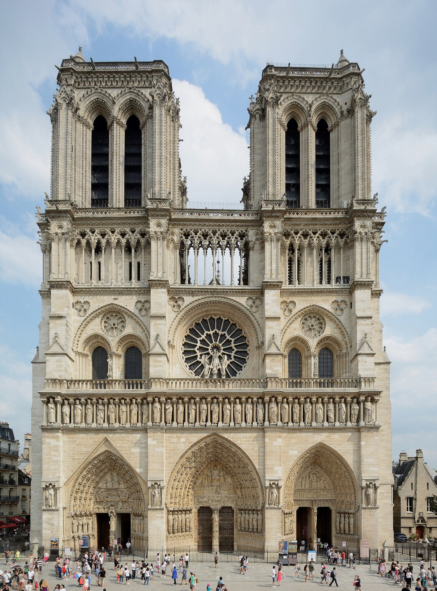

# Введение

## Что такое готика

Готический собор — «каменная книга» Средневековья: каждая пинакля, каждый
барабан окна прочитывался грамотным горожанином как строка писания.

Новый стиль родился во Франции около 1140 года и за сто лет распространился
по всей Европе — от Парижа до Кёльна и Саламанки.

## Термин и определение

Слово «готика» изначально было насмешкой: итальянские гуманисты называли
средневековое искусство «варварским», делом готов.

> Готика — художественный стиль, возникший в середине XII века во Франции
> на основе развития романской строительной техники.

---

Содержание этого слайда разделено горизонтальной линией: обе страницы
получают один и тот же заголовок.

### Строгое замечание

Заголовок третьего уровня — это просто жирный текст, а не новый слайд.

# Конструкции

## Нервюрный свод

Крестовый нервюрный свод позволил собрать распор в узких рёбрах и слегка
облегчить кладку между ними.



## Розетка

Огромные розетки заполняли светом восточную часть храма; диаметр розетки

Шартрского собора превышает двенадцать метров.






## Хронология

| Год  | Событие                  | Место    |
| ---- | ------------------------ | -------- |
| 1143 | Первые нервюры           | Сен-Дени |
| 1194 | Пожар и новый Шартр      | Шартр    |
| 1231 | Начало Амьенского собора | Амьен    |

## Вертикальная диаграмма

Диаграмма справа — вертикальная, поэтому движок отдаёт ей боковую колонку
на **всю высоту**, а текст сжимается в левую.


# Практика

## Задание

Опишите композицию западного фасада собора Парижской Богоматери по
прилагаемой фотографии: выделите ярусы, порталы, розетку и галерею королей.



## Итог

```{=typst}
#focus-slide[Собор — это машина для света]
```
